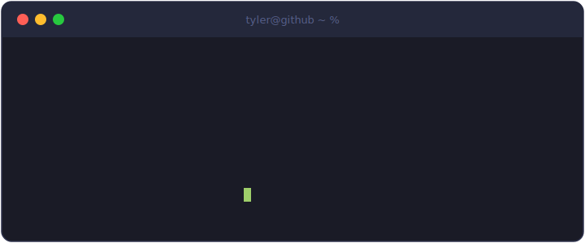

## Hey, I'm Tyler

I dig into complex problems and build tools that people actually want to use.

I'm focused on **agentic AI** and **full-stack development** — I think a lot of the repetitive work we do today will soon be handled by autonomous agents, and I want to be one of the people building those systems.

---

### Projects

**[bag-sale](https://github.com/NightGhost4/bag-sale)** — Event management application
Platform for running a bag-sale event — public registration, an admin dashboard for lineup and winner selection, and automated SMS notifications via SendBlue.

**[design-agent](https://github.com/NightGhost4/design-agent)** — Visual design agent
An autonomous agent that generates frontend code, renders and screenshots its own output, and iteratively improves it using AI vision-based critique against professional design references.

**[portfolio](https://github.com/NightGhost4/portfolio)** — Personal portfolio site
Full-screen, keyboard-navigable Next.js portfolio with a dedicated case-study page for every project. Source for tylernorcross.com.

**[roomnet-2024-2025](https://github.com/NightGhost4/roomnet-2024-2025)** — Roommate matching platform
Roommate matching platform for university students, designed to be embedded directly inside housing portals.

**[uefamodel](https://github.com/NightGhost4/uefamodel)** — UEFA Champions League predictor
Machine learning model predicting match outcomes using recency-weighted multinomial logistic regression on historical data from 2019–2023, achieving 73.1% test accuracy.

---

### Tech Stack

- **Languages:** Python, JavaScript, TypeScript
- **Focus:** AI agents, full-stack web apps, developer tooling
- **Practices:** Clean architecture, testing, version-control hygiene

---

### Contact

- **Email:** tylernorcross04@gmail.com
- **GitHub:** [@NightGhost4](https://github.com/NightGhost4)

